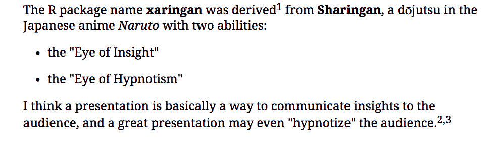
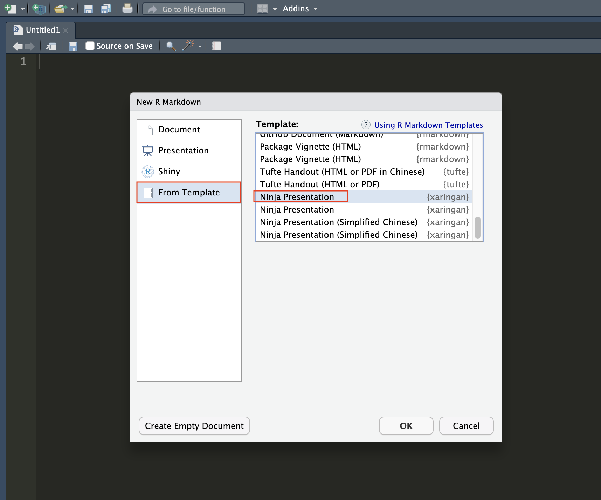
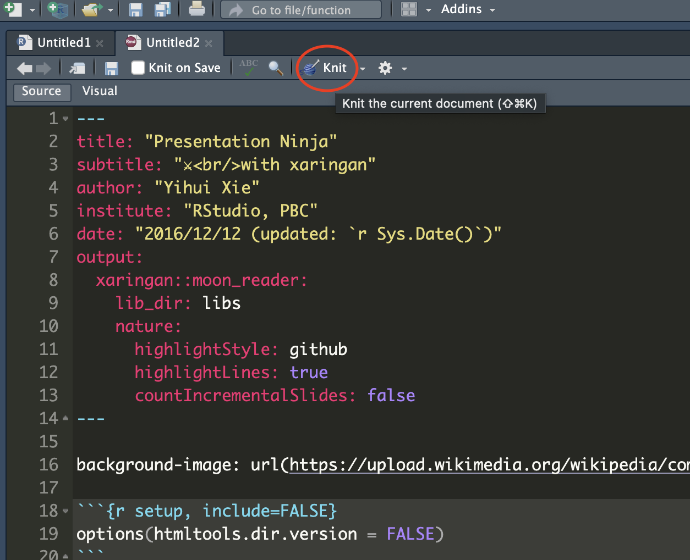
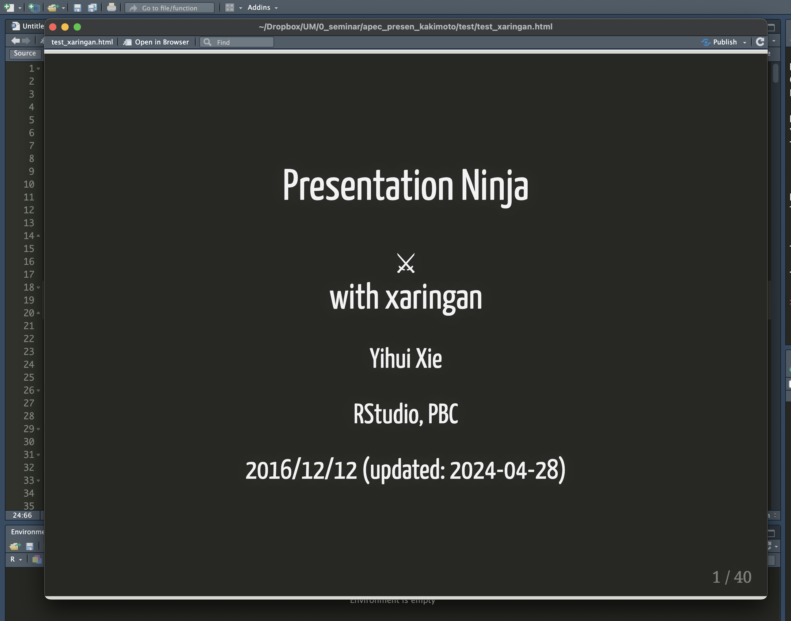

class: middle

```{r, include = F, cache = FALSE}
here::i_am("slides/z_presen.rmd")
```

```{r, child = 'setup.rmd', cache = FALSE}
```

```{r, include = F, cache = F}
knit_child("PrepareResults.rmd", quiet = TRUE)
```
.content-box-green[**NOTE**]

Animations are embed in some slides. Please see the HTML format of the slides. 

<br>

.content-box-green[**A Useful tip:**]

hitting letter "o" key will give you a panel view of the slides

---
class: middle

# Today's Outline

1.[Introduction: What is xaringan and Why?](#intro)

2.[Flavor of xaringan slides](#falvor) 

3.[How to make presentation slides with xaringan?](#how)

4.[Extensions for xaringan presentations](#extention)

<br>

**Source materials for this session:**

+ `r Citet(bib, "xie2018r")` ["R markdown: The definitive guide"](https://bookdown.org/yihui/rmarkdown/#ref-xie2015)

---
class: inverse, center, middle
name: intro

# Introduction: What is xaringan and Why?

<html><div style='float:left'></div><hr color='#EB811B' size=1px width=796px></html>

---
background-image: url(https://upload.wikimedia.org/wikipedia/commons/b/be/Sharingan_triple.svg)
background-size: 90px
background-position: 90% 5%

class: middle

# Sharingan (写輪眼)

<br>

.center[
.blockquote[
```{r, out.width = "80%"}

```
.right[-- <cite>[`r Citet(bib, "xie2021")`, Slide#41](https://slides.yihui.org/xaringan/#41)</cite>]
]
]

.pull-left[]

.pull-right[]

???
+ It is funny that a Japanese person, me, talks about this xaringan package. 
+ The name "xaringan" comes from the famous Japanese anime called "Naruto.", which is a anime of ninja. It's so famous that some of you might know the anime. 

+ The name of this cool looking dude is Sasuke, which is the second main character in the anime, 
  + What is the US anime character that matches the relationship between Sasuke and Naruto?

+ Of course, each character has a unique ability. This guy has a special kind of eyes, and  and sharingan is his ability. 

+ The punch line here is that the xarigan presentation has many 

---
background-image: url(https://presentable-user2021.netlify.app/packages/xaringan/featured-hex.png)
background-size: 100px
background-position: 90% 8%

class: middle

## So, what does xaringan do?

.blockquote[
The xaringan package is an R Markdown extension based on the JavaScript library remark.js to generate HTML5 presentations. 
]

<br>

Multiple components are involved to create cool HTML5 slides. 

--

1.&nbsp; remark.js (JavaScript `r fa("js", height='25px', fill = "black")` + Markdown `r fa("markdown", height='25px', fill = "black")`)

--

2.&nbsp;<b>xaringan</b> connects remark.js to R markdown. 

--

`r fa('lightbulb',height='20px',fill='exclamation')` See [this blog](https://yihui.org/en/2017/08/why-xaringan-remark-js/) for more about *xaringan/ remark.js*. 

???
+ remark.js is a tools to create slides that can be used in browser. 

+ https://www.verouden.net/slides/presentation-xaringan/#10
  + Basically xaringan injected the chakra of R Markdown (minus Pandoc) into remark.js. The slides are rendered by remark.js in the web browser, and the Markdown source needed by remark.js is generated from R Markdown (knitr).


---
class: middle

## Why xaringan presentation might be your new tool?

I like xaringan presentation mainly because...

`r fa('lightbulb',height='20px',fill='steelblue')` You can write everything in R Markdown.

--

`r fa('lightbulb',height='20px',fill='steelblue')` You can easily incorporate figures and tables created with `r fa("r-project", fill = "steelblue")` and/or `r fa("python", fill = "steelblue")` (Python): 
 
&nbsp; &nbsp; &nbsp; `r fa('comments',height='20px',fill='steelblue')` Of course, you can create figures and tables within the xaringan .Rmd file.

&nbsp; &nbsp; &nbsp; `r fa('comments',height='20px',fill='steelblue')` or, if you have .Rmd file that contains all figures and tables you used in writing your paper, you can directly call those objects by loading the file in the xaringan .Rmd file. 

<br>

````markdown
```{r, include = FALSE}
knitr::knit_child("PrepareResults.rmd", quiet = TRUE)
```
````

---
class: middle

### Furthermore...

In terms of its functionality, 

`r fontawesome::fa('lightbulb',height='20px',fill='steelblue')` There are many awesome functionalities in xaringan! For example, `code highlighter` and `clipboard`. For lab session involving coding, these functions are helpful for both instructors and students. 

--

`r fontawesome::fa('lightbulb',height='20px',fill='steelblue')` xaringan slides allow interactive presentations, which potentially make your presentation more fun!


???
+ Well there are lots of options to make presentation slides. I think the most common ways is to 

+ We mostly create figures and tables with some 

---
class: inverse, center, middle
name: falvor

# Flavor of xaringan presentation

<html><div style='float:left'></div><hr color='#EB811B' size=1px width=796px></html>

???
+ Well there are tons of useful functionalities in xaringan package. 
+ Here, I would like to introduce the flavor of xaringan presentation with my slides I used for my recitation session.

---
class: middle

```
# Header 1
## Header 2
### Header 3

+ Item 1
  + Item 2

**highlighted text**

*italic text*

.bold[bold text]
```

# Header 1
## Header 2
### Header 3

+ list 1
  + list 2

**highlighted text**

*italic text*

.bold[bold text]

---
class: middle

## Columns and Content color boxes

````markdown
.pull-left[ 
this text is shown in the left column

.content-box-blue[text in blue box ...]

.content-box-red[text in red box ...]

.content-box-gray[text in gray box ...]

]

.pull-right[ 
this text is shown in the right column

.content-box-green[text in green box ...]

.content-box-yellow[text in yellow box ...]

.content-box-purple[text in purple box ...]

]
````
.pull-left[ 
this text is shown in the left column
]

.pull-right[ 
this text is shown in the right column
]

---
class: middle

# Math

LaTeX commands works fine. For example, 

<br>

.content-box-green[Example 1: Inline equations]
````markdown
$\omega_1=(6,10)$ and $\omega_2=(6,0)$
````

$\omega_1=(6,10)$ and $\omega_2=(6,0)$

<br>

.content-box-green[Example 2: Equations]
````markdown
$$U_j(x_j, y) = x_j + \theta_j ln \, y$$
````

$$U_j(x_j, y) = x_j + \theta_j ln \, y$$

---
class: middle

# Math 

.content-box-green[Example 3: Equations]
````markdown
\begin{aligned}
\max_{x_1,y_1} \quad & U_1(x_1, y_1)=x_1y_1 \\
\textrm{s.t.} \quad & max[x_2, y_2] = \overline{u_2} \\
  & x_1 + x_2 = 16 \\
  & y_1 + y_2 = 16
\end{aligned}
````

\begin{aligned}
\max_{x_1,y_1} \quad & U_1(x_1, y_1)=x_1y_1 \\
\textrm{s.t.} \quad & max[x_2, y_2] = \overline{u_2} \\
  & x_1 + x_2 = 16 \\
  & y_1 + y_2 = 16
\end{aligned}

---
class: middle

## Figures

.content-box-green[**Examples: Jensen's inequality**]

.panelset[ 

.panel[.panel-name[Example 1 : g(x) is convex]
.left5[

Suppose that $g(x)=x^2$.

.small-code[
```{r, echo=T}
set.seed(356)

# Create a sequence of X from a uniformal distribution
x <- seq(0, 10, by=0.01)

# /*===== Convex case: g(X)=X^2 =====*/
y <- x^2

fig_convex <-
  ggplot() +
  geom_point(aes(x = x, y = y), size=0.5) +
  # --- Add E[X] --- #
  geom_vline(
    xintercept = mean(x), color = "red", linetype = "dashed"
    ) +
  annotate(
    "text", x = mean(x)+1, y = 0.01,
    label = paste0("E[X]=", round(mean(x), 1)), size = 3, color = "red"
    ) +
  # --- Add horizontal line for E[g(X)]--- #
  geom_hline(
    yintercept = mean(y), color="blue", linetype = "dashed"
    ) +
  annotate(
    "text", x = 1, y = mean(y)+5,
    label = paste0("E[g(X)]=", round(mean(y), 1)), size = 3, color = "blue"
    ) +
  # --- Add horizontal line for g(E[X]) --- #
  geom_hline(
    yintercept = mean(x)^2, color="darkgreen", linetype = "dashed"
    ) +
  annotate(
    "text", x = 1, y = mean(x)^2-5,
    label = paste0("g(E(X))=", round(mean(x)^2, 1)), size = 3, color = "darkgreen"
    ) +
  theme_bw()
```
  ]
  ]
.right5[
```{r, echo=F, out.width = "100%"}
fig_convex
```

$$\color{darkgreen}{g(E[X])} \leq \color{blue}{E[g(X)]}$$
  ]
]

.panel[.panel-name[Example 2: g(x) is concave]
.left5[

Suppose that $g(x)=\sqrt{x}$.

.small-code[
```{r, echo=T, out.width = "50%"}
# /*===== Convex case: g(X)=X^(1/2) =====*/
y <- x^(1/2)

figure_ex2 <-
  ggplot()+
  geom_point(aes(x = x, y = y), size=0.5) +
  # --- Add E[X] --- #
  geom_vline(
      xintercept = mean(x), color = "red", linetype = "dashed"
    ) +
  annotate(
    "text", x = mean(x)+0.8, y = 0.01,
    label = paste0("E[X]=", round(mean(x), 1)), size = 3, color = "red") +
  # --- Add E[g(X)] --- #
  geom_hline(
    yintercept = mean(y), color = "blue", linetype = "dashed"
    ) +
  annotate(
    "text", x = 1, y = mean(y)-0.2,
    label = paste0("E[g(X)]=", round(mean(y), 2)), size = 3, color = "blue"
    ) +
  # --- Add g(E[X]) --- #
  geom_hline(
    yintercept = mean(x)^(1/2), color = "darkgreen", linetype = "dashed"
    ) +
  annotate(
    "text", x = 1, y = mean(x)^(1/2)+0.2,
    label = paste0("g(E(X))=", round(mean(x)^(1/2), 2)), size = 3, color = "darkgreen"
    ) +
  theme_bw()
```
  ]
  ]
.right5[
```{r, echo=F, out.width = "100%"}
figure_ex2
```
$$\color{blue}{E[g(X)]} \leq \color{darkgreen}{g(E[X])}$$
  ]
]
]


---
class: middle

## Line highlighting

An example of using the trailing comment `#<<` to highlight lines:

### Code

.pull-left[
````markdown
`r ''````{r}
library(ggplot2)
ggplot(mtcars) + 
  aes(mpg, disp) + 
  geom_point() +   #<<
  geom_smooth()    #<<
```
````
]

.pull-right[
### Output

```{r, eval=FALSE, echo=TRUE}
library(ggplot2)
ggplot(mtcars) + 
  aes(mpg, disp) + 
  geom_point() +   #<<
  geom_smooth()    #<<
```
]


---
class: middle

## Figure: Create maps with `leaflet` package

```{r, fig.dim = c(4, 7)}
map_hpa_bd
```

---
class: middle

## Tables

For example, regression results can be shown like this. 

.panelset[ 
<!-- Panel 1 -->
.panel[.panel-name[Code]
.medium-code[
```{r, echo=TRUE}
library(modelsummary)
library(gt)

# === Load Data === #
url <- 'https://vincentarelbundock.github.io/Rdatasets/csv/HistData/Guerry.csv'
dat <- read.csv(url)

# === Run regressions === #
models <- list(
  "OLS 1" = lm(Donations ~ Literacy + Clergy, data = dat),
  "OLS 2" = lm(Crime_pers ~ Literacy + Clergy, data = dat),
  "OLS 3" = lm(Crime_prop ~ Literacy + Clergy, data = dat)
  )
```

```{r, echo=TRUE, eval=FALSE}
# === Report results with modelsummary === #
modelsummary(
  models, 
  fmt = "%.2f",
  gof_map = c("nobs", "r.squared"),
  stars = TRUE,
  notes = list("You can leave a note here"),
  output = "gt"
  ) %>%
  tab_options(table.font.names = "Times New Roman")
```
  ]
  ]
<!-- Panel 2 -->
.panel[.panel-name[Regression result]
.medium-code[
```{r}
modelsummary(
  models, 
  fmt = "%.2f",
  gof_map = c("nobs", "r.squared"),
  stars = TRUE,
  notes = list("You can leave a note here"),
  output = "gt"
  ) %>%
  tab_options(table.font.names = "Times New Roman")
```
  ]
  ]
]

---
class: middle

## Animation with `gganimate`

.content-box-green[Example 1: PDF and CDF]

```{r, dpi=36, cache=TRUE, out.width = "80%"}
cdf_pdf_gif <- image_read(here("Data/cdf_pdf.gif"))
cdf_pdf_gif
```

.medium[
\begin{align*}
\color{blue}{CDF}:& \, f(x) = F(x) = Pr(X \leq x) = \int_{-\infty}^x f(t) dt \\
\color{blue}{PDF}:& \, f(x) = \frac{d}{dx}F(x) \quad \text{by definition of PDF}
\end{align*}
]

---
class: middle

## Animation with `gganimate`

.content-box-green[Example 2: Measurement error bias in linear regression]

```{r, cache=FALSE, fig.dim = c(8, 5)}
animate(plot_me, fps = 20, duration=10, stard_pause = 10)
```

---
class: middle

.content-box-green[Example 3: Utility maximization problem]

\begin{align}
\max_{x_1, y_1} \quad & U_1(x_1, y_1)=x_1 y_1 \\
\textrm{s.t.} \quad & p_x x_1 + p_y y_1 = 4 p_x
\end{align}

```{r, cache=FALSE, fig.dim = c(6, 5), out.width="80%"}
animate(p1_annimate, fps = 20, end_pause = 5)
```

---
class: middle

# Citations and references

You can cite any source from your .bib file via [RefManageR](https://docs.ropensci.org/RefManageR/reference/Cite.html) package. You need to Setup the `BibOptions` at the beginning of your slides like [this](https://github.com/yihui/xaringan/wiki/Bibliography-and-citations).

<br>

Then, use `Citet` or `Citep` to cite a study.

For example, 

```{r, echo=TRUE, eval=FALSE}
# For inline text citation
`r Citet(bib, "xie2022")` created xaringan. 
```
`r Citet(bib, "xie2022")` created xaringan. 


```{r, echo=TRUE, eval=FALSE}
The xaringan package `r Citep(bib, "xie2022")` is an R Markdown extension.
```
The xaringan package `r Citep(bib, "xie2022")` is an R Markdown extension.

---
class: middle

Then, put the following code in the final slides to show all the citations you cited. 

<br>

For example, 

# References

````markdown
```{r, results='asis', echo=FALSE}
PrintBibliography(bib)
```
````

---
class: middle

# HTML to PDF slides

With `to_pdf` funtion of [renderthis](https://github.com/jhelvy/renderthis) package, you can easily render xaringan HTML slides to pdf slides.

For more detail, see [this](https://jhelvy.github.io/renderthis/articles/renderthis.html).

```{r, eval=FALSE, echo=TRUE}
# === Install package === #
remotes::install_github("jhelvy/renderthis", dependencies = TRUE)

# === Get PDF slides from HTML slides === #
renderthis::to_pdf(
  from = here("slides/z_presen.html"),
  complex_slides = TRUE, 
  partial_slides = TRUE
  )
```

---
class: middle, center


---
class: inverse, center, middle
name: how

# How to make presentation slides with xaringan

<html><div style='float:left'></div><hr color='#EB811B' size=1px width=796px></html>

---
class: middle

# Let's create xaringan presentation

The most easiest way to start is:

1. Open your RStudio IDE. 
2. Go to File &rarr; New File &rarr; R Markdown &rarr; From Template &rarr; Ninja Presentation

3. Click the `knit` button on the left corner (or Ctrl+Shift+K) to compile it. 

.panelset[ 

<!-- Panel 1 -->
.panel[.panel-name[Instatall package]
If you haven't installed the packages yet: 
```{r, eval=F, echo=TRUE}
# === install xaringan === #
remotes::install_github("yihui/xaringan")
```
  ] 

<!-- Panel 2 -->
.panel[.panel-name[Generate template slides]

.left3[
From top-down of New file icon on the left corner, crick <span style="color:blue">R Markdown</span>. 

Then, <span style="color:blue">From Template</span> &rarr; <span style="color:blue">Ninja Presentation</span>
]

.right7[
```{r, fig.dim = c(4, 7), out.width = "80%"}

```
]
]

<!-- Panel 3: Knit -->
.panel[.panel-name[Compile the file]

.left3[
Then, crick the <span style="color:blue">knit</span> button. 

]

.right7[
```{r, fig.dim = c(4, 7), out.width = "80%"}

```
]
]

<!-- Panel 4: Output -->
.panel[.panel-name[Output]

.left3[
After knitted the file, the slides are popped up. 

]

.right7[
```{r, fig.dim = c(4, 7), out.width = "80%"}

```
]
]

]

---
class: middle

# Basic components of xaringan slides

+ YAML header
+ `---` : for new slides
+ ???: for presentation notes


---
class: middle

# YAML header


---
class: inverse, center, middle
name: extention

# Extensions for xaringan presentations

<html><div style='float:left'></div><hr color='#EB811B' size=1px width=796px></html>

---
background-image: url(https://presentable-user2021.netlify.app/packages/xaringanextra/featured-hex.png)
background-size: 100px
background-position: 90% 8%

class: top, animated slideInRight fadeOutLeft

# xaringanExtra

<br>

`xaringanExtra` package (Check [here](https://pkg.garrickadenbuie.com/xaringanExtra/#/README?id=xaringanextra)) <br> offers extentional functionalities to `xaringan` slides.


<br>

```{r, eval=F}
# === Instration === #
remotes::install_github("gadenbuie/xaringanExtra")
```

---

.panelset[ 

<!-- Panel 1: Tile View-->
.panel[.panel-name[Tile View]

Press `O` key on the slide below. 

```{r, fig.dim = c(4, 6), out.width = "50%"}
embed_xaringan(
  url = "https://pkg.garrickadenbuie.com/xaringanExtra/tile-view/#1"
  # ratio = "8:6"
)
```
]
<!-- Panel 2: Panelset -->
.panel[.panel-name[Panelset]
```{r, fig.dim = c(4, 6), out.width = "50%"}
embed_xaringan(
  url = "https://pkg.garrickadenbuie.com/xaringanExtra/panelset/#1"
  # ratio = "8:6"
)
```
]
<!-- Panel 3: Clipboard -->
.panel[.panel-name[Clipboard]
```{r, fig.dim = c(4, 6), out.width = "50%"}
embed_xaringan(
  url = "https://pkg.garrickadenbuie.com/xaringanExtra/clipboard/#1"
  # ratio = "8:6"
)
```
]
<!-- Panel 4: Extra Styles -->
.panel[.panel-name[Extra Styles]
```{r, fig.dim = c(4, 6), out.width = "50%"}
embed_xaringan(
  url = "https://pkg.garrickadenbuie.com/xaringanExtra/extra-styles/#1"
  # ratio = "8:6"
)
```
]
<!-- Panel 5: Animate.css -->
.panel[.panel-name[Animate.css]
```{r, fig.dim = c(4, 6), out.width = "50%"}
embed_xaringan(
  url = "https://pkg.garrickadenbuie.com/xaringanExtra/animate-css/#1"
  # ratio = "8:6"
)
```
]
]


---
background-image: url(https://presentable-user2021.netlify.app/packages/xaringanthemer/featured-hex.png)
background-size: 100px
background-position: 90% 8%

class: middle, animated slideInLeft fadeOutRight

# xariganthemer


---
class: middle

.content-box-green[**Useful websites for xaringan slides**]

1.The xaringan intro slides: [Presentation Ninja with xaringan](https://slides.yihui.org/xaringan/#1)

`r fa('lightbulb',height='20px',fill='desktop')` Covers the most basics to help you get started

2.


[A Bag of R Markdown Tricks](https://slides.yihui.org/2020-genentech-rmarkdown.html#1)


Others: 

[Sharing Your Work with xaringan](https://spcanelon.github.io/xaringan-basics-and-beyond/slides/day-01-basics.html?panelset=xaringan&panelset4=remark.js2&panelset5=nhsrtheme2&panelset6=moon-reader2&panelset7=markdown2#5)


