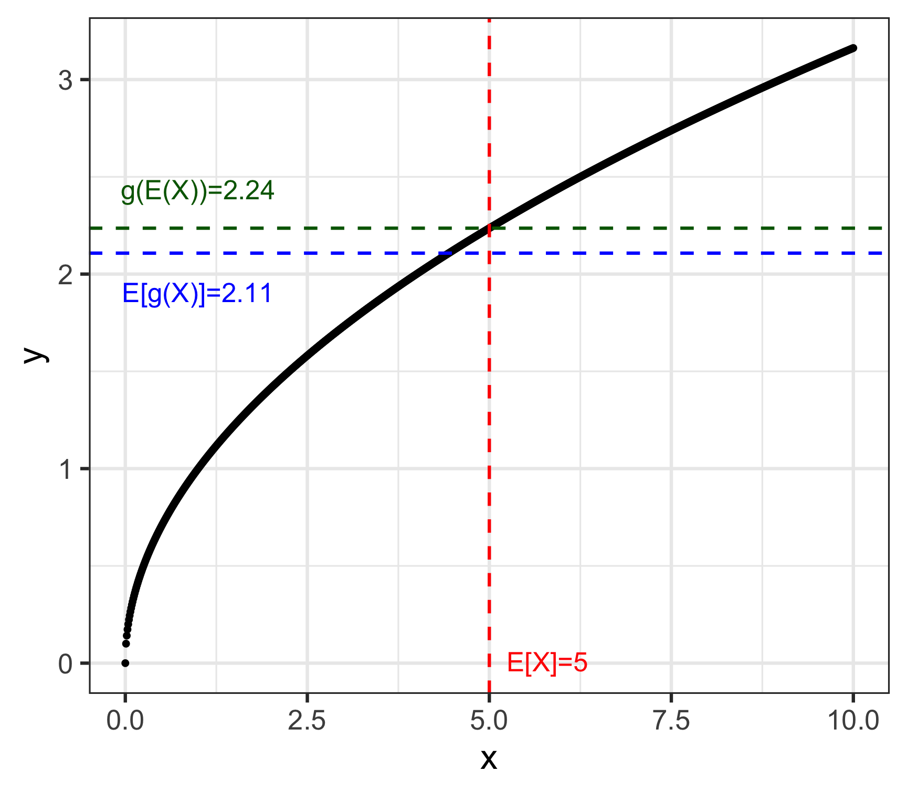

class: middle

```{r, child = 'setup.rmd', cache = FALSE}
```

```{r, include = F, cache = F}
knit_child("PrepareResults.rmd", quiet = TRUE)
```

.content-box-yellow[**A Useful tip:**]

hitting letter "o" key will give you a panel view of the slides

---
class: middle

## Today's Outline

1.[Introduction: What is xaringan and why it could be your best friend?](#intro)

2.[Examples of xaringan slides](#falvor) 

3.[How to make presentation slides with xaringan?](#how)

4.[Extensions for xaringan presentations](#extension)

5.[Introduction to quarto revealjs slides by Matt](#quarto)

<br>

**Source materials for this session:**

+ `r Citet(bib, "xie2018r")` ["R markdown: The definitive guide"](https://bookdown.org/yihui/rmarkdown/#ref-xie2015)


---
class:center, middle
name: intro

# Introduction: What is xaringan?

<div style='float:left'></div><hr color='#ffcc33' size=2px width=800>

---
background-image: url(https://upload.wikimedia.org/wikipedia/commons/b/be/Sharingan_triple.svg)
background-size: 90px
background-position: 90% 5%

class: middle

## Sharingan (写輪眼)
.center[
.blockquote[
```{r, fig.dim = c(4, 7), out.width = "75%"}

```
.right[-- <cite>[`r Citet(bib, "xie2021")`, Slide#41](https://slides.yihui.org/xaringan/#41)</cite>]
]
]
.pull-right[]


<!-- https://media1.tenor.com/m/GeZQuGDMxZEAAAAC/macromatical-rhinoverse.gif -->

---
background-image: url(https://presentable-user2021.netlify.app/packages/xaringan/featured-hex.png)
background-size: 100px
background-position: 90% 8%

class: middle

## What does xaringan do?

.blockquote[
The xaringan package is an R Markdown extension based on the JavaScript library remark.js to generate HTML5 presentations. 
]

<br>

Multiple components are involved to create cool HTML5 slides. 

--

1.&nbsp; remark.js (JavaScript `r fa("js", height='25px', fill = "black")` + Markdown `r fa("markdown", height='25px', fill = "black")`)

--

2.&nbsp;<b>xaringan</b> connects remark.js to R markdown. 

--

`r fa('lightbulb',height='20px',fill='steelblue')` See [this blog](https://yihui.org/en/2017/08/why-xaringan-remark-js/) for more about *xaringan/ remark.js*. 

---
class: middle

## Why xaringan might be your new presentation tool?

I like xaringan presentations mainly because...

`r fa('lightbulb',height='20px',fill='steelblue')` You can write everything in R Markdown.

--

`r fa('lightbulb',height='20px',fill='steelblue')` You can easily incorporate figures and tables created with `r fa("r-project", fill = "steelblue")`: 
 
  + `r fa('comments',height='20px',fill='steelblue')` You can work on figures and tables within the xaringan .Rmd file.

  + `r fa('comments',height='20px',fill='steelblue')` or, if you have .Rmd file that contain all figures and tables you used in writing your paper, you can directly call those objects by loading the file in the xaringan .Rmd file. 

````markdown
`r ''````{r, include = FALSE}
knitr::knit_child("PrepareResults.rmd", quiet = TRUE)
```
````

---
class: middle

### Furthermore...

In terms of its functionality, 

`r fontawesome::fa('lightbulb',height='20px',fill='steelblue')` There are many awesome functionalities in xaringan! For example, `code highlighter` and `clipboard`. For lab session involving coding, these functions are helpful for both instructors and students. 

--

<br>

`r fontawesome::fa('lightbulb',height='20px',fill='steelblue')` xaringan slides allow interactive presentations, which potentially make your presentation more intriguing and fun!


---
class: center, middle
name: falvor

# Examples of xaringan Presentations

<div style='float:left'></div><hr color='#ffcc33' size=2px width=800>


---
class: middle

.medium[
```{r, echo=TRUE, eval=FALSE}
# Header 1
## Header 2
### Header 3

+ Item 1
  + Item 2

**emphasized text**

*italic text*
```
]

# Header 1
## Header 2
### Header 3

+ list 1
  + list 2

**emphasized text**

*italic text*


---
class: middle

## Columns and Content color boxes

.medium[
````markdown
.pull-left[ 
this text is shown in the left column

.content-box-blue[text in blue box ...]

.content-box-red[text in red box ...]
]

.pull-right[ 
this text is shown in the right column

.content-box-yellow[text in green box ...]

.content-box-yellow[text in yellow box ...]
]
````
]

.pull-left[ 
this text is shown in the left column

.content-box-blue[text in blue box ...]

.content-box-red[text in red box ...]
]

.pull-right[ 
this text is shown in the right column

.content-box-green[text in green box ...]

.content-box-yellow[text in yellow box ...]
]


---
class: middle

# Math

LaTeX commands works fine (most of the time). 

For example, 

<br>

.content-box-yellow[Example 1: Inline equations]
````markdown
$\omega_1=(6,10)$ and $\omega_2=(6,0)$
````

$\omega_1=(6,10)$ and $\omega_2=(6,0)$

<br>

.content-box-yellow[Example 2: Equations]
````markdown
$$U_j(x_j, y) = x_j + \theta_j ln \, y$$
````

$$U_j(x_j, y) = x_j + \theta_j ln \, y$$

---
class: middle

# Math 

.content-box-yellow[Example 3: Equations]
````markdown
\begin{aligned}
\max_{x_1,y_1} \quad & U_1(x_1, y_1)=x_1y_1 \\
\textrm{s.t.} \quad & max[x_2, y_2] = \overline{u_2} \\
  & x_1 + x_2 = 16 \\
  & y_1 + y_2 = 16
\end{aligned}
````

\begin{aligned}
\max_{x_1,y_1} \quad & U_1(x_1, y_1)=x_1y_1 \\
\textrm{s.t.} \quad & max[x_2, y_2] = \overline{u_2} \\
  & x_1 + x_2 = 16 \\
  & y_1 + y_2 = 16
\end{aligned}

---
class: middle 

## Figures
.content-box-yellow[Examples: Jensen's inequality]
.panelset[ 
.panel[.panel-name[Example 1 : g(x) is convex]
```{r, fig.dim = c(4, 6), out.width = "50%"}

```
$$\color{darkgreen}{g(E[X])} \leq \color{blue}{E[g(X)]}$$
  ]

.panel[.panel-name[Example 2: g(x) is concave]
```{r, fig.dim = c(4, 6), out.width = "50%"}

```
$$\color{blue}{E[g(X)]} \leq \color{darkgreen}{g(E[X])}$$
  ]
]

---
class: middle

## Figure: Create maps with `leaflet`

```{r, fig.dim = c(4, 7)}
map_hpa_bd
```

---
class: middle

## Tables
For example, regression results can be shown like this. 
.panelset[ 
<!-- Panel 1 -->
.panel[.panel-name[Code]
.small-code[
```{r, echo=TRUE}
library(modelsummary)
library(gt)

# === Load Data === #
url <- 'https://vincentarelbundock.github.io/Rdatasets/csv/HistData/Guerry.csv'
dat <- read.csv(url)

# === Run regressions === #
models <- list(
  "OLS 1" = lm(Donations ~ Literacy + Clergy, data = dat),
  "OLS 2" = lm(Crime_pers ~ Literacy + Clergy, data = dat),
  "OLS 3" = lm(Crime_prop ~ Literacy + Clergy, data = dat)
  )
```
```{r, echo=TRUE, eval=FALSE}
# === Report results with modelsummary === #
modelsummary(
  models, 
  fmt = "%.2f",
  gof_map = c("nobs", "r.squared"),
  stars = TRUE,
  notes = list("You can leave a note here"),
  output = "gt"
  ) %>%
  tab_options(table.font.names = "Times New Roman")
```
  ]
  ]
<!-- Panel 2 -->
.panel[.panel-name[Regression result]
.small-code[
```{r}
modelsummary(
  models, 
  fmt = "%.2f",
  gof_map = c("nobs", "r.squared"),
  stars = TRUE,
  notes = list("You can leave a note here"),
  output = "gt"
  ) %>%
  tab_options(table.font.names = "Times New Roman")
```
  ]
  ]
]

---
class: middle

## Animation with `gganimate`

.content-box-yellow[Example 1: PDF and CDF]
.center[

]

.medium[
\begin{align*}
\color{blue}{CDF}:& \, F(x) = Pr(X \leq x) = \int_{-\infty}^x f(t) dt \\
\color{blue}{PDF}:& \, f(x) = \frac{d}{dx}F(x) \quad \text{by definition of PDF}
\end{align*}
]

---
class: middle

## Animation with `gganimate`

.content-box-yellow[Example 2: Measurement error bias in linear regression]

```{r, cache=FALSE, fig.dim = c(8, 5), out.width = "80%"}
animate(plot_me, fps = 20, duration=10, stard_pause = 10)
```

---
class: middle

## Citations and references

You can cite any source from your .bib file via [RefManageR](https://docs.ropensci.org/RefManageR/reference/Cite.html) package. You need to setup the `BibOptions` at the beginning of your slides like [this](https://github.com/yihui/xaringan/wiki/Bibliography-and-citations).

--

<br>

Then, use `Citet` or `Citep` to cite a source.

.content-box-green[Example: `Citet`]

```{r, echo=TRUE, eval=FALSE}
# For inline text citation
`r Citet(bib, "xie2022")` created xaringan. 
```
`r Citet(bib, "xie2022")` created xaringan. 


.content-box-green[Example: `Citep`]

```{r, echo=TRUE, eval=FALSE}
# For inline parenthetical citation
The xaringan package `r Citep(bib, "xie2022")` is an R Markdown extension.
```
The xaringan package `r Citep(bib, "xie2022")` is an R Markdown extension.

???
+ You can use bib file to create citations

---
class: middle

Then, put the following code in a r chunk in the final slides to show all the sources you cited. 

<br>

````markdown
`r ''````{r, results='asis', echo=FALSE}
PrintBibliography(bib)
```
````

`r fa('exclamation',height='20px',fill='steelblue')` Don't forget to put `results='asis', echo=FALSE` options in a chunk. 
---
class: middle

## Useful Shortcut Keys for presentation

Hit `h` key on the slide. A list of shortcut keys will be popped up. 

To go back to the slides, hit `h` key again. 

```{r, fig.dim = c(4, 7), out.width = "50%"}
knitr::include_graphics("images/short-cut.png")
```

---
class: middle

## HTML to PDF slides

`to_pdf` funtion of [renderthis](https://github.com/jhelvy/renderthis) package let you render xaringan HTML slides (or .Rmd) to pdf slides.

For more detail, see [this](https://jhelvy.github.io/renderthis/articles/renderthis.html).

`r fa('check',height='20px',fill='lightgreen')`  This function also works with .qmd of Quarto revealjs slides.

<br>

.medium-code[
```{r, eval=FALSE, echo=TRUE}
# === Install package === #
remotes::install_github("jhelvy/renderthis", dependencies = TRUE)

# === Get PDF slides from HTML slides === #
renderthis::to_pdf(
  from = Path/to/an/.Rmd file, # .qmd, .html file, or a UR
  complex_slides = TRUE, 
  partial_slides = TRUE
  )
```
]

---
class: middle, center


---
class:center, middle
name: how

# How to get start to make xaringan presentations?
<div style='float:left'></div><hr color='#ffcc33' size=2px width=800>

---
class: middle

Open your RStudio IDE. 

.panelset[ 

<!-- Panel 1 -->
.panel[.panel-name[Instatall package]
If you haven't installed the packages yet: 
.medium-code[
```{r, eval=F, echo=TRUE}
# === install xaringan === #
remotes::install_github("yihui/xaringan")
```
  ] 
  ]
<!-- Panel 2 -->
.panel[.panel-name[Generate template slides]

.pull-left[
From top-down of New file icon, crick <span style="color:blue">R Markdown</span>.

```{r, fig.dim = c(4, 7), out.width = "60%"}
knitr::include_graphics("images/select-Rmd.png")
```
]

.pull-right[
<span style="color:blue">From template</span> &rarr; select <span style="color:blue">Ninja Presentation</span>

```{r, fig.dim = c(4, 7), out.width = "80%"}
knitr::include_graphics("images/select-xaringan.png")
```
]
]

<!-- Panel 3: Knit -->
.panel[.panel-name[Compile the file]

.left3[
Then, crick the <span style="color:blue">knit</span> button. 

]

.right7[
```{r, fig.dim = c(4, 7), out.width = "80%"}

```
]
]

<!-- Panel 4: Output -->
.panel[.panel-name[Output]

```{r, out.width="70%"}
embed_xaringan(
  url = "https://slides.yihui.org/xaringan/#1"
)
```
<!-- ```{r, fig.dim = c(4, 7), out.width = "80%"}
knitr::include_graphics("images/final-slide.png")
``` -->
  ]
]

---
class: middle

## Basic components of xaringan slides

+ `class` : 
+ `---` : Every new slide is created under three dashes.
+ `--`: to build incremental slides [here](https://slides.yihui.org/xaringan/incremental.html#2)
+ ???: for presentation notes 

---

class: middle

## YAML header

Likewise usual Rmd, YAML header determines the basic structure of the document. 

.panelset[ 
.panel[.panel-name[Template]
.small-code[
```{r, eval=FALSE, echo=TRUE}
---
title: "Presentation Ninja"
subtitle: "⚔<br/>with xaringan"
author: "Yihui Xie"
institute: "RStudio, PBC"
date: "2016/12/12 (updated: `r Sys.Date()`)"
output:
  xaringan::moon_reader:
    lib_dir: libs
    nature:
      highlightStyle: github
      highlightLines: true
      countIncrementalSlides: false
---
```
  ]
  ]

.panel[.panel-name[Add your "own" CSS]
.small-code[
```{r, eval=FALSE, echo=TRUE}
---
title: "Introduction to Making <br> Presentation Slides with xaringan"
subtitle: "APEC Skill Seminar"
author: "Shunkei Kakimoto"
date: "`r Sys.Date()`"
output:
  xaringan::moon_reader:
    lib_dir: libs
    css: 
      - css/umn-style.css
      - css/umn-style-fonts.css
      - css/my-style.css
    nature:
      highlightStyle: github
      highlightLines: false
      highlightLanguage: ["r"]
      countIncrementalSlides: false
      ratio: "15:11"
---
```
  ]
  ]
]

---
class: middle

## What's CSS?

**CSS**: <b>C</b>ascading <b>S</b>tyle <b>S</b>heet

`r fa('check',height='20px',fill='green')`: CSS makes the appearance of your slides stylish. 

`r fa('skull',height='20px',fill='black')`: Creating or modifying a CSS file is a daunting task... 
???
+ 
---
class: center, middle
name: extension

# Extensions for xaringan presentations

<html><div style='float:left'></div><hr color='#EB811B' size=1px width=800px></html>


---
background-image: url(https://presentable-user2021.netlify.app/packages/xaringanthemer/featured-hex.png)
background-size: 100px
background-position: 95% 2%


class: middle, animated slideInLeft fadeOutRight

## xariganthemer

For more detail about `xariganthemer` package, see [this](https://pkg.garrickadenbuie.com/xaringanthemer/index.html). creates a css file with your favorite theme. 

.medium-code[
```{r, echo=TRUE, eval=F}
# === Installation === #
remotes::install_github("gadenbuie/xaringanthemer")
```
]


For example, using `style_duo_accent()`, 
.medium-code[
```{r, echo=TRUE, eval=F}
style_duo_accent_inverse(
  primary_color = "#035AA6", 
  secondary_color = "#03A696"
)
```
]
you can make slides looks like this

```{r, fig.dim = c(4, 7), out.width = "80%"}
knitr::include_graphics("https://raw.githubusercontent.com/gadenbuie/xaringanthemer/assets/example_duo_accent_inverse.png")
```


---
background-image: url(https://presentable-user2021.netlify.app/packages/xaringanextra/featured-hex.png)
background-size: 100px
background-position: 90% 30%

class: middle, animated slideInRight fadeOutLeft

## xaringanExtra

`xaringanExtra` package (Check [here](https://pkg.garrickadenbuie.com/xaringanExtra/#/README?id=xaringanextra)) offers extentional functionalities to `xaringan` slides.

.medium-code[
```{r, echo=TRUE, eval=F}
# === Installation === #
remotes::install_github("gadenbuie/xaringanExtra")
```
]
<br>

Let's see some of the functions in the next slide!


---
class: middle, animated, slideInRight, bounceOutDown

## xaringanExtra
.panelset[ 
<!-- Panel 1: Tile View-->
.panel[.panel-name[Tile View]
Press `o` key on the slide below. 
```{r, fig.dim = c(4, 6), out.width = "50%"}
embed_xaringan(
  url = "https://pkg.garrickadenbuie.com/xaringanExtra/tile-view/#5"
  # ratio = "8:6"
)
```
]
<!-- Panel 2: Panelset -->
.panel[.panel-name[Panelset]
```{r, fig.dim = c(4, 6), out.width = "50%"}
embed_xaringan(
  url = "https://pkg.garrickadenbuie.com/xaringanExtra/panelset/#1"
  # ratio = "8:6"
)
```
]
<!-- Panel 3: Clipboard -->
.panel[.panel-name[Clipboard]
```{r, fig.dim = c(4, 6), out.width = "50%"}
embed_xaringan(
  url = "https://pkg.garrickadenbuie.com/xaringanExtra/clipboard/#2"
  # ratio = "8:6"
)
```
]
<!-- Panel 4: Extra Styles -->
.panel[.panel-name[Extra Styles]
```{r, fig.dim = c(4, 6), out.width = "50%"}
embed_xaringan(
  url = "https://pkg.garrickadenbuie.com/xaringanExtra/extra-styles/#1"
  # ratio = "8:6"
)
```
]
<!-- Panel 5: Animate.css -->
.panel[.panel-name[Animate.css]
```{r, fig.dim = c(4, 6), out.width = "50%"}
embed_xaringan(
  url = "https://pkg.garrickadenbuie.com/xaringanExtra/animate-css/#1"
  # ratio = "8:6"
)
```
]
]

---
class: middle
background-image: url(https://i3.ytimg.com/vi/DoRR2S5lLvk/maxresdefault.jpg)
background-size: 200px
background-position: 90% 5%

### webR Extension for Quarto 
Check [this](https://github.com/coatless/quarto-webr?tab=readme-ov-file) out. Below is an [example slides](https://tmieno2.github.io/R-as-GIS-workshop/vector_basics.html#/title-slide) using Quarto and webR: 
```{r, out.width="70%"}
embed_xaringan(
  url = "https://tmieno2.github.io/R-as-GIS-workshop/vector_basics.html#/title-slide"
)
```

---
class: center, middle

### Thank you!

You can get my xaringan templates from [`r fa('github',height='20px',fill='black')` @shunkei3](https://github.com/Shunkei3/APEC_xaringanPresentations)
